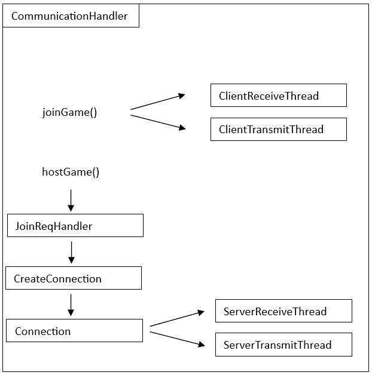

# Fejlesztői dokumentáció

## Main osztály

    exit: Egy logikai érték, ami jelzi, hogy a játék végetért.
    server: Egy logikai érték, ami jelzi, hogy az adott fél szerver vagy kliens.
    DEBUG: Egy logikai érték, amely meghatározza a hibakeresési üzenetek kiírását. Ha true, akkor a hibakeresési üzenetek ki vannak írva, ha false, akkor nincsenek kiírva.
    startTime: Az idő, amikor a játék elindult.
    Multi: Egy logikai érték, ami jelzi, hogy a játék többjátékos módjában fut-e.
    turn: Egy logikai érték, ami jelzi, hogy a játékosnak jelenleg ő a soron következő.
    gameboard: Egy referencia a GameBoard objektumra.
    difficulty: Az aktuális nehézségi szint.
    communicationHandler: Egy referencia a CommunicationHandler objektumra, amely a kliens és szerver közötti kommunikációt kezeli.
    ScoreTracker: Egy referencia a HighScoreTracker objektumra, amely az eredményeket nyomon követi.
    mainmenu: Egy referencia a MainMenuWindow objektumra, amely a főmenüt reprezentálja.
    startData: Egy referencia a StartData objektumra, amely a multiplayer játék esetén elküldésre kerül a kliens oldalnak.
    time: Egy referencia a TimeData objektumra, amivel a kliens oldalnak elküldjük az akutális idejét a játéknak.
    multiPlayerWindow: Egy referencia a MultiPlayerWindow objektumra, amivel a szervert lehet elindítani.

Metódusok

    main(String[] args): A program belépési pontja.
    loop(): A játék ciklikus fővezérlője.
    clickBomb(int x, int y, boolean flag): Az adott mezőre kattintás eseményt kezeli.
    diffToBoard(int diff): Az adott nehézségi szint alapján beállítja a játéktábla méretét és a bombák számát.
    clickGame(boolean MultiPlayer): Az új játék kezdetét kezeli.
    CreateServer(): Szerver mód indítása.
    IPGame(StartData startData): Ha a szerver elindítja a játékot akkor a kliens ezen keresztül kapja meg a játék kezdeti állapotát.
    IPConnect(String IP): Az IP alapú kapcsolat létrehozását kezeli.
    getBombNeibourXY(int x, int y): Az adott mező szomszédos bombáinak számát adja vissza.
    setDifficulty(int diff): A nehézségi szint beállítása.
    receiveClick(int x, int y, boolean flag): A multiplayer játékban ezen a fügvényen keresztül kapja meg a kattintás helyzetét.
    createTimer(): Az időmérő inicializálása.
    getTime(): Az eltelt idő lekérdezése.
    receiveTime(TimeData time): Az idő adatok fogadása.
    setMultiWindowRef(MultiPlayerWindow multiWindowRef): A többjátékos ablak referencia beállítása.
    SetConnected(boolean connected): A szerver ezen a függvényen keresztül kapja meg ha valaki csatlakozott hozzá.


## GameBoard osztály

    DEBUG: Egy logikai érték, amely meghatározza a hibakeresési üzenetek kiírását. Ha true, akkor a hibakeresési üzenetek ki vannak írva, ha false, akkor nincsenek kiírva.
    MAX_X, MAX_Y, MIN_X, MIN_Y: Az aknakereső játéktábla maximális és minimális méretei az X és Y tengelyeken.
    MAXiteration: A bombák generálásának maximális iterációs száma, ha ezt túllépem akkor biztos, hogy a játék nem elindítható.
    xSize, ySize: A játéktábla mérete az X és Y tengelyeken.
    BombCount: A bombák száma a játéktáblán.
    rand: Egy Random objektum a véletlenszerű számok generálásához.
    minesweeperGUI: Egy referencia az MinesweeperGUI objektumra.
    board: Egy két dimenziós Block objektumokból álló tömb, amely reprezentálja a játéktáblát.

Metódusok

    GameBoard(): Konstruktor, létrehoz egy GameBoard objektumot.
    xSet(int x): Beállítja az X tengely méretét és ellenőrzi a megadott értéket. Visszaadja a hibakódot, ha nem a határokon belül van a beállított érték.
    ySet(int y): Beállítja az Y tengely méretét és ellenőrzi a megadott értéket. Visszaadja a hibakódot, ha nem a határokon belül van a beállított érték.
    bombSet(int b): Beállítja a bombák számát és ellenőrzi a megadott értéket. Visszaadja a hibakódot, ha nem a határokon belül van a beállított érték.
    setBoardSize(int x, int y, int BC): Beállítja a játéktábla méretét és a bombák számát.Visszaadja a hibakódot, ha nem a határokon belül van a beállított érték.
    generateBoard(): Generálja a játéktáblát a beállított mérettel és bombaszámmal. Visszaadja a hibakódot, ha nem sikerül legenerálni a táblát.
    neigbourReferences(): Beállítja a szomszédos mezők referenciáit.
    printBoard(): Kiírja a játéktábla aktuális állapotát.
    setBoard(boolean[][] bombarray): Beállítja a játéktáblát a megadott bombatérkép alapján.
    revealXY(int x, int y): Felfedi az (x, y) koordinátájú mezőt. Visszaadja, hogy bomba volt-e a mező.
    flagXY(int x, int y): Beállítja vagy törli a zászlót az (x, y) koordinátájú mezőn. Visszaadja az aktuális zászlóállapotot.
    getBombNeibourXY(int x, int y): Visszaadja a (x, y) koordinátájú mező szomszédos bombák számát.
    setGUIref(): Beállítja a minesweeperGUI referenciát a játéktáblára.
    isVictory(): Ellenőrzi, hogy teljesült-e a győzelmi feltétel (minden nem bomba mező felfedezve). Visszaadja, hogy győzelem történt-e.
    getXSize(): Visszaadja a játéktábla X tengelyének méretét.
    getYSize(): Visszaadja a játéktábla Y tengelyének méretét.
    getBombMap(): Visszaadja a bombatérképet logikai tömb formájában.
    revealbombs(): Felfedi az összes bombát a játéktáblán.

## Block Osztály

    isBomb: Egy logikai érték, amely jelzi, hogy a mezőn van-e bomba.
    isFlagged: Egy logikai érték, amely jelzi, hogy a mezőre zászló lett-e helyezve.
    isRevealed: Egy logikai érték, amely jelzi, hogy a mezőt felfedték-e.
    x: Az x koordináta értéke.
    y: Az y koordináta értéke.
    bombNeibour: A szomszédos mezőkön található bombák száma.

Metódusok

    getFlag(): Visszaadja, hogy a mezőre zászló lett-e helyezve.
    isBomb(): Visszaadja, hogy a mezőn van-e bomba.
    isRevealed(): Visszaadja, hogy a mezőt felfedték-e.
    getXCoord(): Visszaadja az x koordináta értékét.
    getYCoord(): Visszaadja az y koordináta értékét.
    setFlagged(boolean flag): Beállítja a mezőre zászlót és frissíti a GUI-t.
    reveal(): Felfedi a mezőt és az ahhoz tartozó üres mezőket, ha nem lett zászlóval ellátva.
    setNeibours(Block[] N): Beállítja a szomszédos mezők referenciáit és kiszámolja a szomszédos bombák számát.
    printstate(): Kiírja a mező állapotát a konzolra.
    getBombNeibour(): Visszaadja a szomszédos bombák számát.
    setGUIref(MinesweeperGUI ref): Beállítja a GUI referenciát.
    revealBomb(): Felfedi a bombát a GUI-n.

## ClickData Osztály

    x_cord: A kattintás x koordináta értéke.
    y_cord: A kattintás y koordináta értéke.
    flag: Logikai érték, amely jelzi, hogy a kattintás zászló-e.

Metódusok

    ClickData(int x, int y, boolean f): Az osztály konstruktora, beállítja az x és y koordinátákat, valamint a zászló jelölést.

## StartData

    xsize: A játéktábla szélességét jelző egész szám.
    ysize: A játéktábla magasságát jelző egész szám.
    bombMap: Egy boolean típusú tömb, amely a bombák elhelyezkedését tartalmazza a játéktáblán.
    difficulty: Az aktuális nehézségi szintet jelző egész szám.

Metódusok

    setDifficulty(int diff): Beállítja a nehézségi szintet a megadott értékre.
    setXsize(int x): Beállítja a játéktábla szélességét a megadott értékre.
    setYsize(int y): Beállítja a játéktábla magasságát a megadott értékre.
    setBombMap(boolean[][] b): Beállítja a bombatérképet a megadott tömb értékeire.
    getDifficulty(): Visszaadja a nehézségi szintet.
    getXsize(): Visszaadja a játéktábla szélességét.
    getYsize(): Visszaadja a játéktábla magasságát.
    getBombMap(): Visszaadja a bombatérképet.

## TimeData

    Time: Az időértéket tartalmazó hossz típusú változó.

## MinesweeperGUI osztály

A `MinesweeperGUI` osztály egy felhasználói felületet nyújt a "Minesweeper" játékhoz. Az osztály felelős a játéktábla megjelenítéséért, a gombok kezeléséért és a játékállapot frissítéséért.

### Konstruktor:

```java
public MinesweeperGUI(int rows, int cols)
```

- `rows`: A játéktábla sorainak száma.
- `cols`: A játéktábla oszlopainak száma.

Inicializálja a játékot a megadott mérettel. Betölti a szükséges ikonokat (zászló, számok, bomba), majd meghívja az `initializeBoard()` és az `initializeGUI()` metódusokat.

### Metódusok:

```java
private void initializeBoard()
```

Inicializálja a játéktáblát, létrehozva egy üres `int[][]` tömböt a sorok és oszlopok számával.

```java
private void initializeGUI()
```

Inicializálja a grafikus felületet (`JFrame`). Létrehoz egy `JPanel`-t a gombok elhelyezéséhez, majd létrehozza és hozzáadja a gombokat a panelhez. Beállítja a megfelelő méreteket, betűtípust és eseménykezelőt. Végül hozzáadja a panelt a `JFrame`-hez, beállítja a láthatóságot és a megjelenítési helyet.

```java
private class ButtonListener extends MouseAdapter
```

Ez az osztály felelős a gombok eseménykezeléséért. Figyeli a gombok kattintását és a jobb egérgomb lenyomását.

```java
private void revealMines(int i, int j)
```

Megjeleníti az összes bomba ikont a játéktáblán, a megadott pozíció kivételével.

```java
public void revealEmptyCells(int row, int col)
```

Megjeleníti a játéktáblán az üres cellákat, rekurzívan felfedve az összes szomszédos üres cellát is. A `row` és `col` paraméterek meghatározzák a kiindulási cella pozícióját.

```java
private void disableButtons()
```

Letiltja az összes gombot a játéktáblán.

```java
public void victory()
```

Megjeleníti a "Gratulálunk! Nyertél!" üzenetet és letiltja az összes gombot.

```java
public void defeat()
```

Megjeleníti a "Játék vége!" üzenetet és letiltja az összes gombot.

```java
public void changeFlagStatus(int x, int y, boolean flag)
```

Megváltoztatja a megadott pozícióban lévő gomb ikonját a zászló ikonra vagy a nullára (`null`) a `flag` paraméter alapján.

Ezen felül a `MinesweeperGUI` osztály rendelkezik a következő adattagokkal:

- `private JButton[][] buttons`: A játéktábla gombjait tartalmazó 2D-s tömb.


## Main Menu Window

Az osztály konstruktora inicializálja a főmenü ablakát. Beállítja az ablak címét, bezárás működését és a méretet. Létrehoz egy `JPanel` objektumot, amely a főmenüt fogja tartalmazni. Beállítja a panel elrendezését `GridLayout`-ra, amely egy oszlopos elrendezést használ. Beállítja a háttérszínt, a margókat és a belső margókat.

Létrehozza a különböző gombokat (`Difficulty`, `1 Player`, `2 Player`, `Connect`) és beállítja a gomb méretét, betűtípusát és eseménykezelőt. Az eseménykezelők reagálnak a gomb lenyomására és elvégzik a megfelelő műveleteket. Például a `Difficulty` gomb lenyomásakor megnyitja a nehézségi ablakot (`DifficultyWindow`), a `1 Player` gomb lenyomásakor pedig elindítja a játékot egyjátékos módra.

Létrehozza a `textField` objektumot, amely egy szövegmezőt tartalmaz.

Hozzáadja a gombokat és a szövegmezőt a panelhez, majd beállítja a panelt az ablak tartalmára. Beállítja az ablak méretét és helyzetét, majd láthatóvá teszi az ablakot.

#### `openMinesweeperGUI()`

Ez a privát segédmetódus a Minesweeper GUI-t nyitja meg. Beállítja a játékmező méretét és az aknák számát. Bezárja a főmenü ablakot, majd létrehozza és megjeleníti a `MinesweeperGUI` objektumot a megadott paraméterekkel.

#### `main(String[] args)`

Ez a metódus az alkalmazás belépési pontja. Létrehoz egy `MainMenuWindow` objektumot, amely inicializálja és megjeleníti a főmenüt.

Ez a dokumentáció röviden áttekinti a `MainMenuWindow` osztályt és annak metódusait, amelyek felelősek a főmenü grafikus felhasználói felületének létrehozásáért és az események kezeléséért.
- `private int[][] board`: A játéktábla állapotát tároló 2D-s tömb.
- `private int rows`: A játéktábla sorainak száma.
- `private int cols`: A játéktábla oszlopainak száma.
- `private ImageIcon flagIcon`: A zászló ikon.
- `private ImageIcon[] numberIcons`: A számok ikonjainak tömbje.
- `private ImageIcon bombIcon`: A bomba ikon.


## MultiPlayer Window

#### Metódusok:

#### `MultiPlayerWindow()`

Az osztály konstruktora inicializálja a többjátékos ablakát. Beállítja az ablak címét és a méretet. Létrehoz egy `JPanel` objektumot, amely a többjátékos ablak tartalmát fogja tartalmazni. Beállítja a panel elrendezését `GridLayout`-ra, amely egy oszlopos elrendezést használ. Beállítja a háttérszínt, a margókat és a belső margókat.

Létrehozza a "Create Server" gombot (`createServerButton`) és beállítja a méretét, betűtípusát és eseménykezelőt. Az eseménykezelő arra reagál, hogyha a gombot megnyomják, és meghívja a `Main.CreateServer()` metódust.

Létrehozza a `connectedIndicator` nevű `JLabel` objektumot, amely az állapotjelzőt fogja tartalmazni. Beállítja a méretét és frissíti az állapotjelzőt a `updateConnectedIndicator()` metódus segítségével.

Létrehozza a "Start Game" gombot (`startGameButton`) és beállítja a méretét, betűtípusát és eseménykezelőt. Az eseménykezelő arra reagál, hogyha a gombot megnyomják, és elindítja a többjátékos játékot a `Main.clickGame(true)` és `Main.createTimer()` metódusok meghívásával, valamint bezárja a többjátékos ablakot.

Hozzáadja a gombokat és az állapotjelzőt a panelhez, majd beállítja a panelt az ablak tartalmára. Beállítja az ablak méretét és helyzetét, majd láthatóvá teszi az ablakot.

#### `main(String[] args)`

Ez a metódus az alkalmazás belépési pontja. Létrehoz egy `MultiPlayerWindow` objektumot, amely inicializálja és megjeleníti a többjátékos ablakot.

#### `setConnected(boolean connected)`

Ez a metódus beállítja a `isConnected` változót a kapott értékre, majd frissíti az állapotjelzőt a `updateConnectedIndicator()` metódus segítségével.

#### `updateConnectedIndicator()`

Ez a privát segédmetódus frissíti az állapotjelzőt a `isConnected` változó alapján. Ha a `isConnected` értéke igaz, akkor a háttérszín zöld lesz, egyébként piros. Beállítja az állapotjelzőt átlátszóvá, hogy megjelenjen a háttérszín változása.


## Difficulty Window

### Metódusok:

#### `DifficultyWindow()`

Az osztály konstruktora inicializálja a nehézségi ablakot. Beállítja az ablak címét és a méretet. Létrehoz egy `JPanel` objektumot, amely a nehézségi ablak tartalmát fogja tartalmazni. Beállítja a panel elrendezését `GridLayout`-ra, amely egy oszlopos elrendezést használ. Beállítja a háttérszínt, a margókat és a belső margókat.

Létrehozza a "Chill" gombot (`chillButton`) és beállítja a méretét, betűtípusát és eseménykezelőt. Az eseménykezelő arra reagál, hogyha a gombot megnyomják, és beállítja a `diffnum` változót 1-re, majd meghívja a `Main.setDifficulty(diffnum)` metódust.

Létrehozza az "Eco" gombot (`ecoButton`) és beállítja a méretét, betűtípusát és eseménykezelőt. Az eseménykezelő arra reagál, hogyha a gombot megnyomják, és beállítja a `diffnum` változót 2-re, majd meghívja a `Main.setDifficulty(diffnum)` metódust.

Létrehozza a "Ludicrous" gombot (`ludicrousButton`) és beállítja a méretét, betűtípusát és eseménykezelőt. Az eseménykezelő arra reagál, hogyha a gombot megnyomják, és beállítja a `diffnum` változót 3-ra, majd meghívja a `Main.setDifficulty(diffnum)` metódust.

Hozzáadja a gombokat a panelhez, majd beállítja a panelt az ablak tartalmára. Beállítja az ablak méretét és helyzetét, majd láthatóvá teszi az ablakot.

#### `main(String[] args)`

Ez a metódus az alkalmazás belépési pontja. Létrehoz egy `DifficultyWindow` objektumot, amely inicializálja és megjeleníti a nehézségi ablakot.


## CommunicationHandler



A feladata, hogy segítsen vezérelni minden kommunikációval kapcsolatos eljárást.
Ezt az osztályt kell példányosítani és ennek a függvényeivel lehet meghívni a játék számára szolgáltatott funkciókat.
```java
public boolean joinGame(String ip)
```
Paraméterként kap egy string-et, mely azt az IP címet tartalmazza amelyre csatlakozni szeretnénk. A Cél egy TCP kapcsolat kialakítása.
Ennek megfelelően, kliensként létrehoz egy socket-et, elmenti a hozzá tartozó I/O stream-eket,
majd pedig küld egy egy joinRequest típusú üzenetet (Message class), várakozik a válaszra és ha sikerült a kapcsolat,
létrehoz a kliens számára egy üzenet fogadó és küldő class-t (ClientReceiveThread és ClientTransmitThread).
```java
public void hostGame()
```

Ha ez a függvény hívódik, akkor az azt jelenti, hogy Host-ként fog funkcionálni a CommunicationHandler class.
A JoinReqHandler class segítségével létrehozza a server socket-et, és várakozik arra, hogy valaki csatlakozzon hozzá.
Ezt a folyamatot a JoinReqHandler.start() fügvénnyel lehet elindítani.
JoinReqHandler-rel kapcsolatos információkat a hozzá tartozó leírásánál részletezem.
```java
public void stopAllCommunication()
```

Meghívásakor megszünteti az eddig létrehozott kommunikációs kapcsolatot,
legyen az kliens vagy host, és ezt üzenetként jelzi is a másik félnek.

```java
public void sendStartGame(Object data)
```

Host esetén, készít egy üzenetet a kapott paraméter alapján, ami a generált aknamezőt tartalmazza és továbbítja azt a kliensnek.

```java
public void sendClickData(Object data)
```

Készít egy üzenetet a kapott paraméter alapján, ami a kliens vagy a host aknamezején történt kattintással kapcsolatos információkat tartalmazza,
és továbbítja az a másik félnek.

```java
public void sendTimeData(Object data)
```

Host esetén, készít egy üzenetet a kapott paraméter alapján, ami a játékidőt tartalmazza,
és továbbítja az a másik félnek.

```java
public boolean checkIfConnectionActive()
```

CommunicationHandler egy változóját vizsgálja, ami ha nem null értékű, akkor az azt jelenti, hogy a host-hoz csatlakoztak, létrejött egy kapcsolat.

## Message

A segítségével készítjük el az üzeneteket, melyek nem csupán adattal rendelkeznek, hanem meg is lehet határozni az üzenet típusát.
- `joinRequest`
- `joinAccepted`
- `stopCommunication`
- `startingMinefieldData`
- `clickData`
- `timeData`


## ClientReceiveThread

A joinGame() hívása során jön létre ez a thread. A class feladata, hogy fogadja a szervertől kapott üzeneteket.

```java
public ClientReceiveThread(ObjectInputStream objectInputStream)
```

ObjectInputStream-et kapja paraméterként, melyet eltárol és elindítja a szál futását.

```java
public void run()
```

A szál futása során az objectInputStream-ből kiolvassa a kapott Message class típusú üzeneteket
és a tartalmának megfelelően feldolgozza azokat. Ezután folytatódik a szál futása és további üzenetekre vár.

```java
public void stopReceive()
```

Szükség esetén le lehet állítani a szál futását.

## ClientTransmitThread

A joinGame() hívása során jön létre ez a thread. A kliens nem csak fogadja az üzeneteket, hanem küldeni is szeretne, amit a ClientTransmitThread-del kivitelezek.

```java
public ClientTransmitThread(ObjectOutputStream objectOutputStream)
```

Paraméterként megkapja ObjectOutputStream-et. Létrehoz egy láncolt lista típusú változót, mely a küldendő üzeneteket tárolja.
Továbbá elindítja a szál futását.

```java
public void run()
```

A szál futása során folyamatosan ellenőrzi, hogy van e küldendő üzenet, amennyiben van akkor azt kiveszi a listából, és elküldi, majd pedig
újra megnézi, hogy van e még üzenet a listában.

```java
public void sendMessage(Message msg)
```

A paraméterként kapott üzenetet hozzáadja a láncolt listához, ezáltal ő az a funkció akit meg kell hívni, hogy üzenetet lehessen küldeni.

```java
public void stopTransmit()
```

Szükség esetén le lehet állítani a szál futását.


## JoinReqHandler

Mikor a hostGame függvény meghívódik, egy hosszasabb folyamat indul be, melynek első részét ez a class valósítja meg.
Ez egy thread, ami a konstruktor segítségével azonnal futni kezd.

```java
public void run()
```

Létrehoz egy szerver socket-et, majd várakozunk a kliens csatlakozására. Ha létrejött a kapcsolat, akkor CreateConnection
class segítségével létre hozom a host kommunikációját támogató osztályokat. Ezután már nem lehet csatlakozni a szerverhez.

```java
public void stopListening()
```
Ez a függvény zárja le a szerver socket-et.

## CreateConnection

```java
public CreateConnection(Socket serverSocket, CommunicationHandler communicationHandler)
```

Ennek csupán egy konstruktora van. Ő kezeli le a kapcsolat létrejöttét szerver oldalon. Kizárólag a JoinReqHandler hívja meg.
Ha a szerver input stream-jén érkezö üzenet, joinRequest típusú, akkor létrehoz egy Connection típusú változót.

## Connection

```java
public Connection(Socket serverSocket,
ObjectInputStream objectInputStream,
ObjectOutputStream objectOutputStream
)
```

Miután sikerült a csatlakozás, és meggyőződtünk róla, hogy valóban a játékhoz szeretne csatlakozni a kliens,
a CommunicationHandler activeConnection változóját felülírjuk ennek a class-nak a példányával.
Ez az osztály tárolja el a szerver socket-et, illetve létrehozza és szintén tárolja a szerverhez tartozó kommunikációt segítő osztályokat.

```java
public void closeConnection()
```

A class által felülírt változókat törli és zárja a server socket-et.

## ServerReceiveThread

```java
public ServerReceiveThread(ObjectInputStream objectInputStream, Connection connection)
```

Feladata, hogy fogadja a klienstől kapott üzeneteket. A konstruktora elmenti a paraméterül kapott InputStream objektumot,
és engedélyezi a szál működését.

```java
public void run()
```

Futása során, folyamatosan leolvassa az Input stream-et. Amennyiben olyan üzenet érkezett amire számítottunk,
akkor azt lekezeli, egyébként ignorálja.

```java
public void stopServer()
```
```java
public void startServer()
```

Ez a két függvény tudja tiltani és engedélyezni az Input stream leolvasását, a szál futása közben.

## ServerTransmitThread

```java
public ServerTransmitThread(ObjectOutputStream objectOutputStream, Connection connection)
```

Eredetileg thread lett volna, mint a ClientReceiveThread,
de rájöttem, hogy erre semmi szükség, így végül csak egyfajta interface-ként funkcionál a CommunicationHandler és
az Output stream-nek a writeObject függvénye között.

A következő függvényekkel lehet a megfelelő üzeneteket továbbítani:

```java
public void sendStartGame(Message msg)
```

```java
public void sendClickData(Message msg)
```

```java
public void sendTimeData(Message msg)
```
```java
public void sendStopCommunication(Message msg)
```


